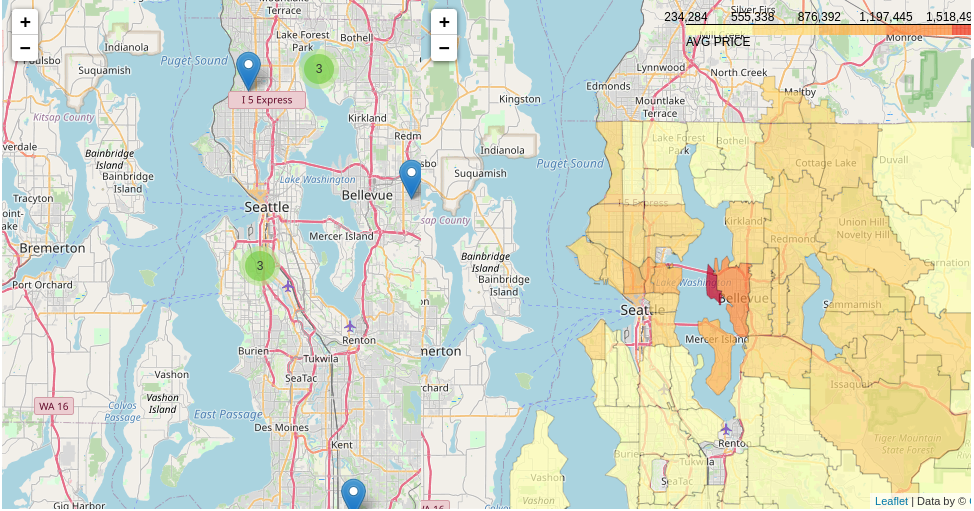
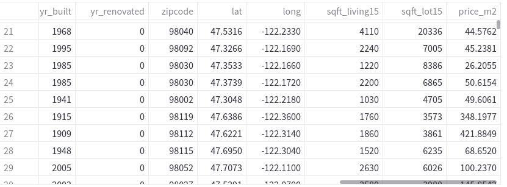

# House Rocket Data

# Problema de negócios

Identificação de imóveis abaixo do preço médio de venda e definição do preço ideal de revenda, a partir de uma análise exploratória de dados em Python.

# Estratégia da Solução

Realizar a análise exploratória de dados nas propriedades disponíveis no conjunto de dados.
Determinar quais propriedades deveriam ser compradas de acordo com os critérios do negócio.
Desenvolver um dashboard online que possa ser acessado pelo CEO através de um celular ou computador.

# Top Data Insights 

Uma visualização de mapa com propriedades disponíveis.

Uma visualização de tabela com filtros de atributos.

# Conjunto de Dados

O conjunto de dados está disponível na plataforma kaggle(https://www.kaggle.com/harlfoxem/housesalesprediction).
